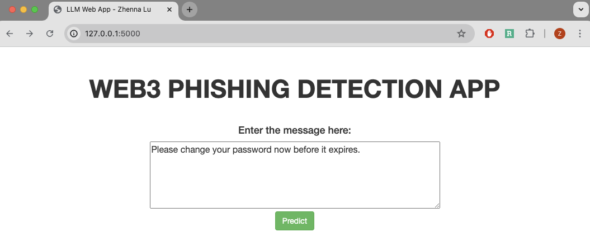
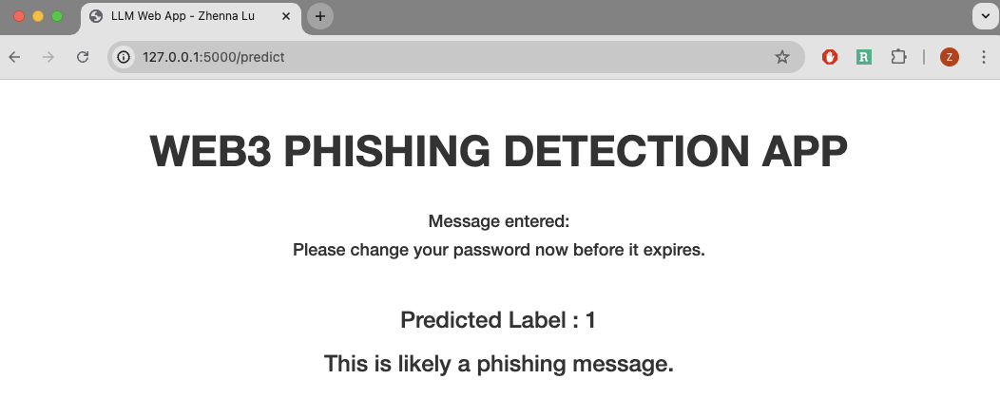

# llm_phishing_detection

This project aims to classify a text message into either `1` (phishing) or `0` (not phishing) categories by training several machine learning models with a csv dataset.

#### Dataset Info

- Path to dataset: `raw_data/data.csv`

- Data Schema
    - Column 1:
        - column name: `Messages`
        - column type: string

    - Column 2:
        - column name: `gen_label`
        - column type: boolean

| Messages | gen_label |
|---|---|
| (message 1)  |  1 |
|  (message 2) |  0 |

- Data Distribution: 474 rows with 262 rows being phishing messages and 212 being non-phishing messages.


### Model metrics benchmarks

|   | f1  | precision  |  recall |  accuracy | training_time  |  inference_time |
|---|---|---|---|---|---|---|

|NB	|0.830188679245283	|0.8461538461538461|	0.8148148148148148|	0.8085106382978723	|0.0032272338867187	|0.0007801055908203|
|LR	|0.8518518518518519	|0.8846153846153846	|0.8214285714285714|	0.8297872340425532|	0.0356471538543701|	0.0002150535583496|
|KNN	|0.7058823529411765|	0.6923076923076923|	0.72|	0.6808510638297872|	0.0005688667297363	|0.0972669124603271|
|SVM	|0.8518518518518519	|0.8846153846153846	|0.8214285714285714	|0.8297872340425532|	0.0274648666381835	|0.0030479431152343|
|XGBoost	|0.9122807017543859	|1.0	|0.8387096774193549	|0.8936170212765957|	0.241973876953125|	0.0040738582611083984|
| RoBERTa|	0.9230769230769231|	0.9230769230769231|	0.9230769230769231	|0.9148936170212766|	24968.250607967377|	68.44634509086609|


## How to execute the training pipeline

1. Build a docker image by running

```shell
docker build -f Dockerfile.python -t my-image .
```

2. To train the LLM, run

```shell
docker run my-image -t train -mt LLM
```

3. To train all baseline models, run

```shell
docker run my-image -t train
```


## How to run the packaged Flask application

1. Containerize the flask app

```shell
docker build -t my-app .
```

2. Run the Flask App for inference

```shell
docker run -p 5000:5000 my-app
```

3. Copy the `http://127.0.0.1:5000/` to your browser and enter your message in the text box. Click "Predict" button to make an inference.



4. The prediction will show up.

